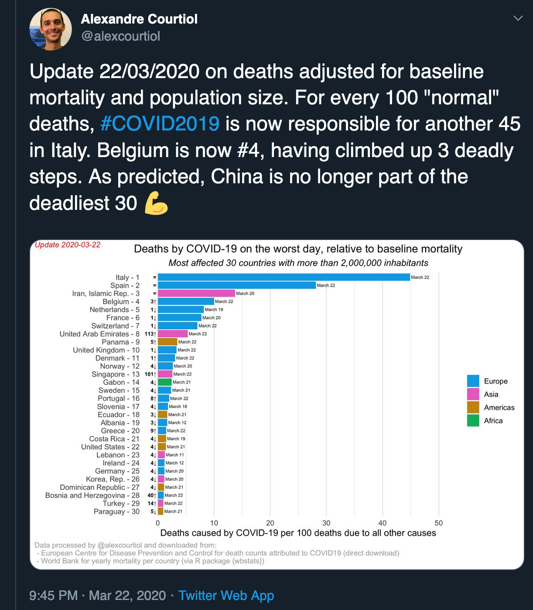

# COVID19

<!-- badges: start -->
<!-- badges: end -->

The goal of this small R project is to plot the COVID19 attributed deaths adjusted for baseline mortality and population size.

### Why?

The motivation for such plots is that most people don't know if X deaths caused by something is a lot or not. Indeed, unless you are a demographer, you probably have no idea how many people die in the world or even in your city, over a year, or over a day. (If you want to know, a good rule of thumb is that over a given year, in a "rich" country, you can expect roughly 1% of its whole population to die.)

### How to read the x-axis?

Here I express the number of _reported_ COVID19 deaths compared to 100 "normal" deaths.

For example, a value of 50 would imply that if 100 normal deaths used to occur in a city, then we would observe 150 deaths in total (100 normal + 50 COVID19 ones) assuming that normal deaths have not changed.

This is more informative than expressing the result as a percentage: if the COVID deaths reach very large numbers, we will still see on this graph such an increase progressing linearly. Instead, expressed as a percentage, the death toll would just slowly converge towards 100%.

If you still want to express such number as a percentage, just do:

For example, with 50 COVID death per 100 normal ones,
the percentage of COVID death is thus 100 * 50/150 = 33.333%.

If instead you want to instead express values along the x-axis as the odd of dying from COVID, just divide the value X you read on the axis by 100:

For example, with 50 COVID death per 100 normal ones,
the odd of COVID death is thus 50/100 = 0.5.

### Caveats

- Some countries (including Italy) seem to underreport death by COVID19. This is because for many deaths occurying outside hospitals the exact cause of death is not known. (We will be able to look at that when overall death rates will be known.)

- Some countries are not included because either we have no data for COVID19, or the population and mortality data are not in the database I am using. The latter is for example the case of Taiwan.

### How to reproduce

Open the project in R and run the code in `main.R`

### Open questions

- Does it make sense to correct for the baseline mortality in each countries (current approach) versus to a common baseline? To some degree, I think _Yes_, as it reflect the overall health situation in a country... which is why I chose to do compute things that way.

### Help & feedbacks wanted!

If you find that this project interesting an idea worth pursuing, please let me know by liking, RT or messaging on Twitter (@alexcourtiol).

Developing is always more fun when it becomes a collaborative work, so please also email me (or leave an issue) if you want to get involved!

